# ControlNet入门指南
## 体验网址
https://huggingface.co/spaces/hysts/ControlNet-v1-1
## Git地址
https://github.com/lllyasviel/ControlNet
https://github.com/lllyasviel/ControlNet-v1-1-nightly
## 扩展阅读
https://www.uisdc.com/stable-diffusion-2
https://www.uisdc.com/controlnet

ControlNet 主要有 8 个应用模型：OpenPose、Canny、HED、Scribble、Mlsd、Seg、Normal Map、Depth。以下做简要介绍：
## OpenPose 姿势识别

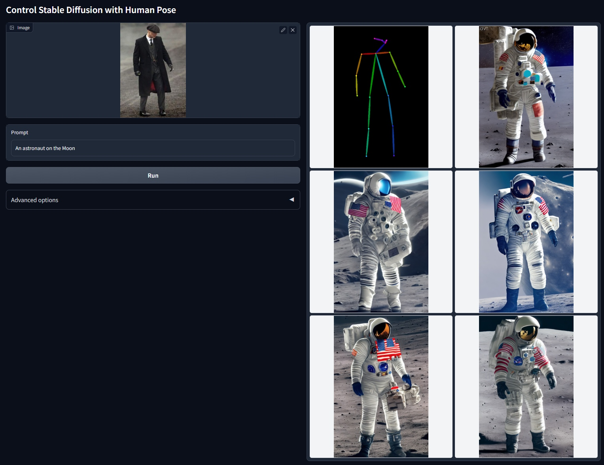
## Canny 边缘检测
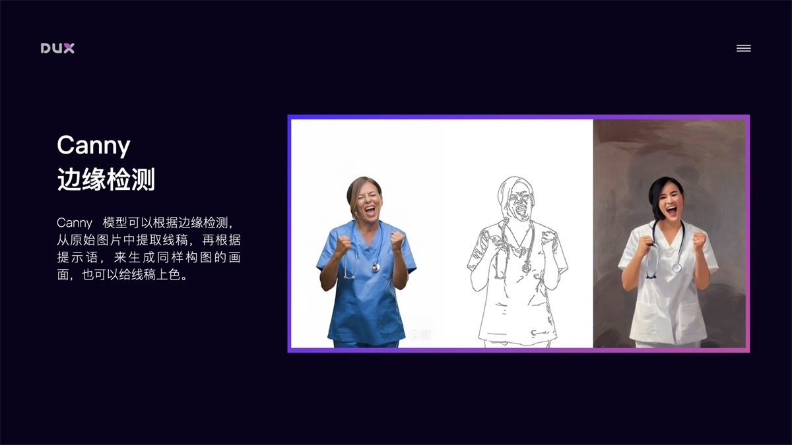
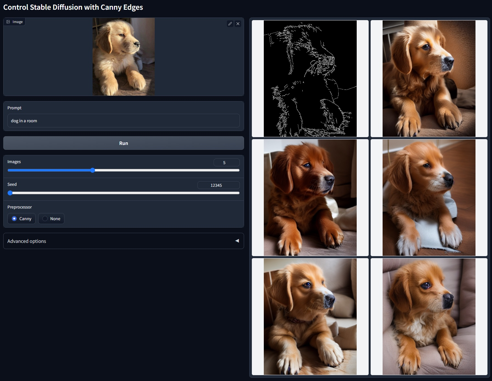
## HED 边缘检测（肖像）

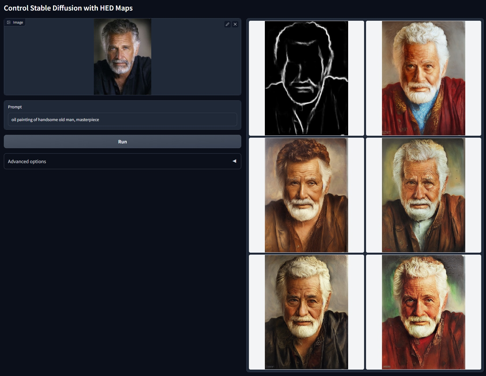
## Scribble 黑白稿提取

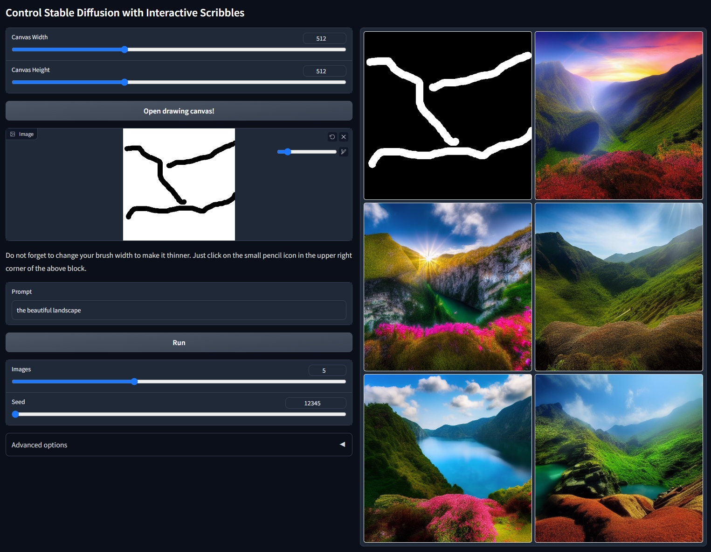
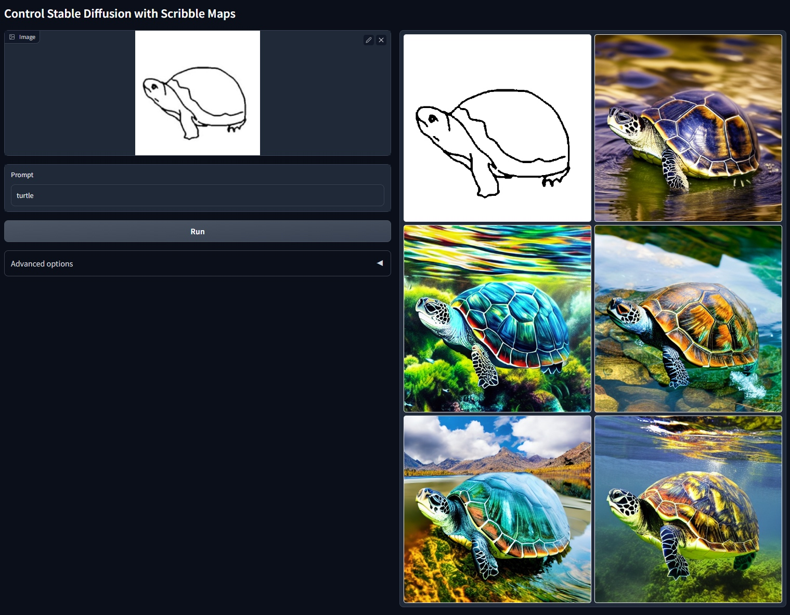
## M-LSD 直线检测
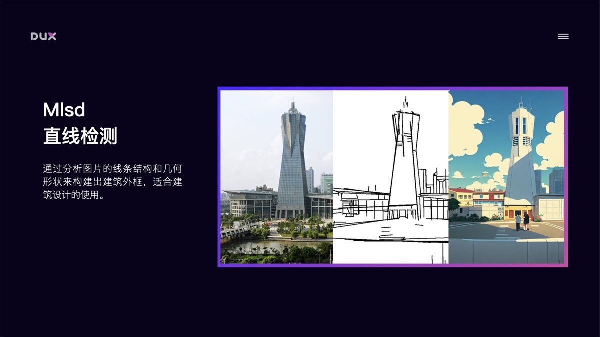
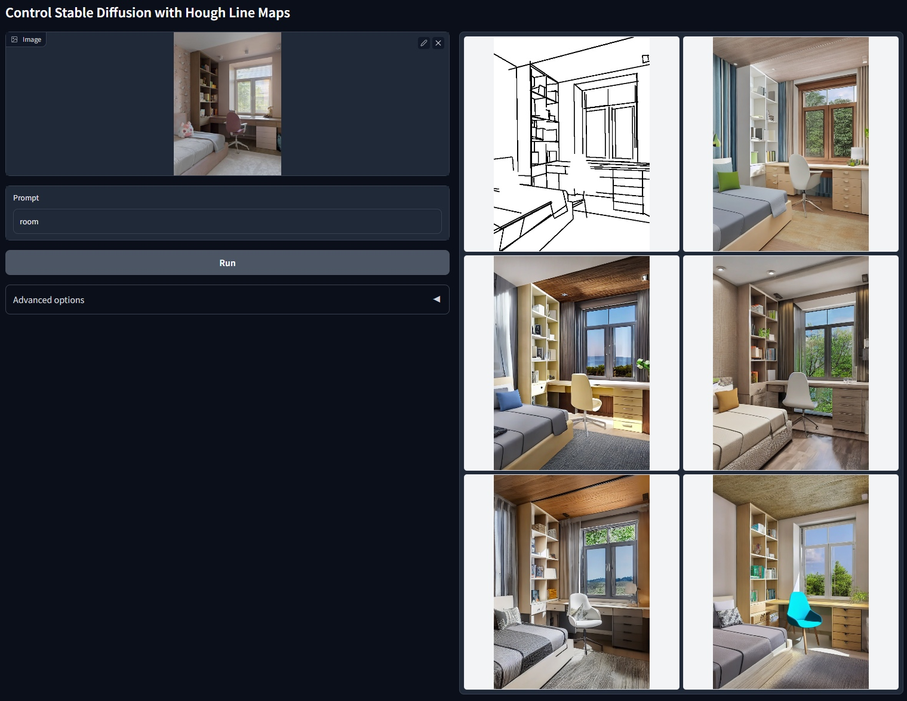
## Seg 区块标注

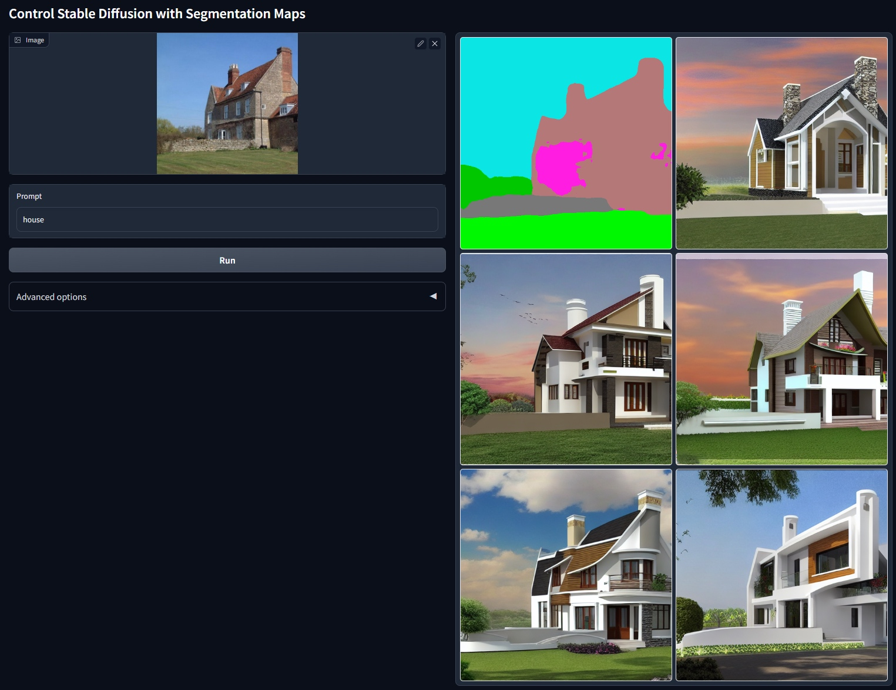
## Normal Map 法线贴图
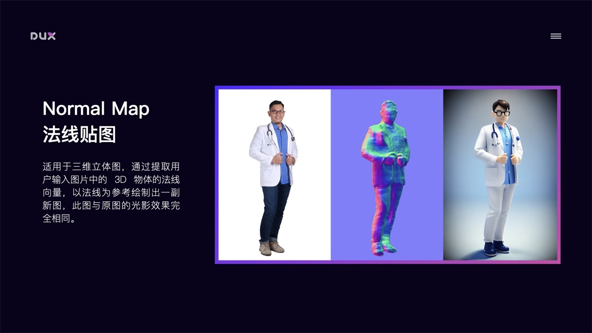
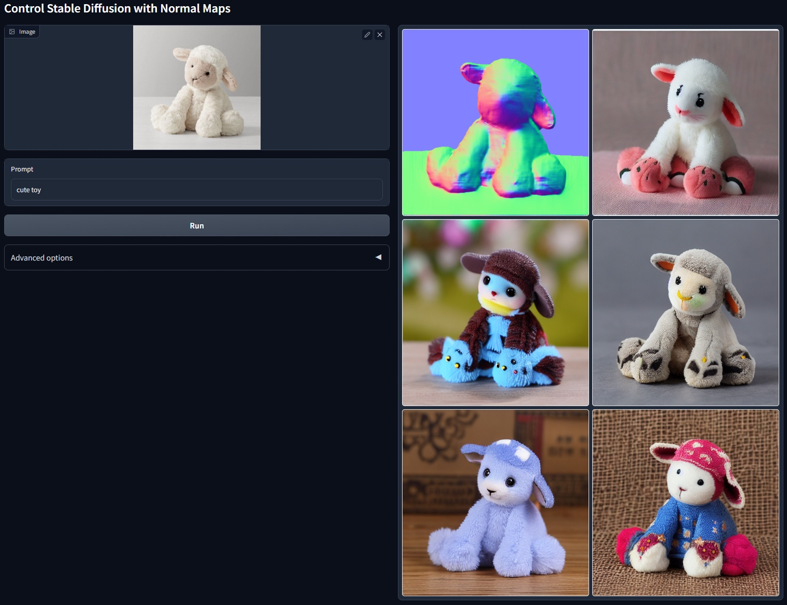
## Depth 深度检测
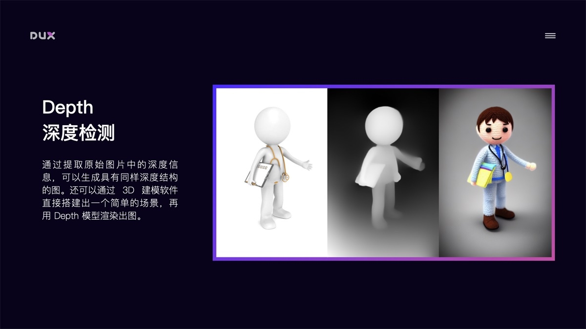
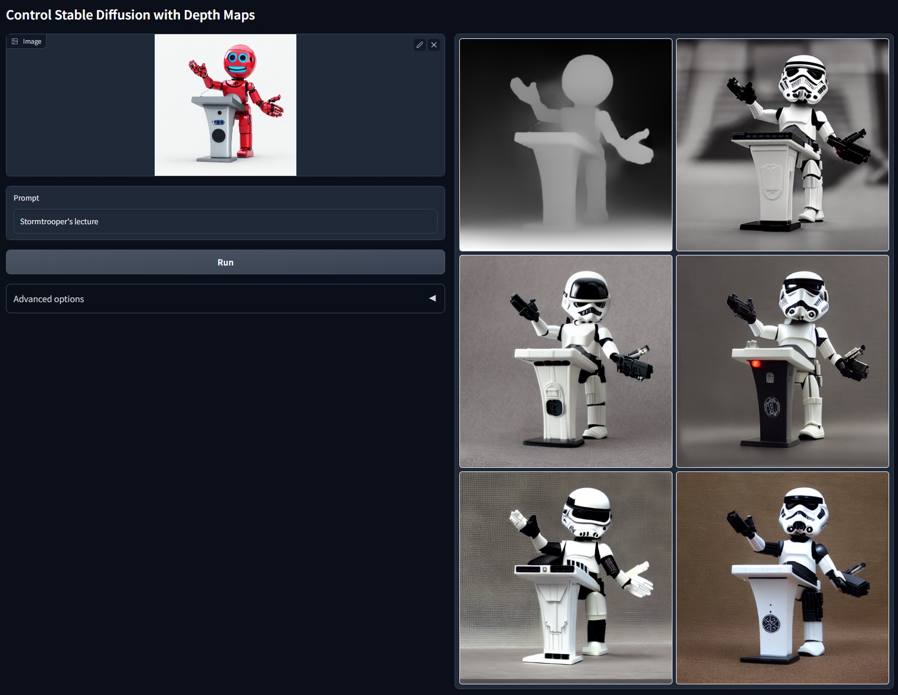