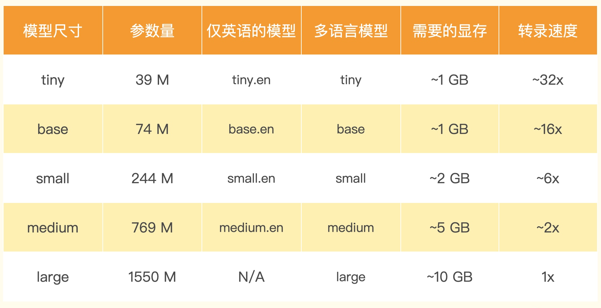

# 音频文件转录
## 播客
https://www.listennotes.com/
## 把 MP4 文件转换成 MP3 格式
1. 安装 FFmpeg 包
```
pip install -U ffmpeg 
```
或者
```
brew install ffmpeg
```
2. 调用 FFmpeg 转换音频格式
```
ffmpeg -i ./data/podcast_long.mp4 -vn -c:a libmp3lame -q:a 4 ./data/podcast_long.mp3
```
## 分割 MP3 文件
按照 15 分钟一个片段的方式切分音频，通过 PyDub 的 AudioSegment 包，我们可以把整个长的 MP3 文件加载到内存里面来变成一个数组。里面每 1 毫秒的音频数据就是数组里的一个元素，我们可以很容易地将数组按照时间切分成每 15 分钟一个片段的新的 MP3 文件。
1. 安装 PyDub 包（https://github.com/jiaaro/pydub）
```
pip install -U pydub
```
2. 切分音频
```
from pydub import AudioSegment

podcast = AudioSegment.from_mp3("./data/podcast_long.mp3")

# PyDub handles time in milliseconds
ten_minutes = 15 * 60 * 1000

total_length = len(podcast)

start = 0
index = 0
while start < total_length:
    end = start + ten_minutes
    if end < total_length:
        chunk = podcast[start:end]
    else:
        chunk = podcast[start:]
    with open(f"./data/podcast_clip_{index}.mp3", "wb") as f:
        chunk.export(f, format="mp3")
    start = end
    index += 1
```
## 转录音频文件
### OpenAI Whisper API 转录
1. python环境设置API-Key
```
export OPENAI_API_KEY=...
```
2. 调用 OpenAI 接口
```
import openai, os

openai.api_key = os.getenv("OPENAI_API_KEY")

prompt = "这是一段Onboard播客，里面会聊到ChatGPT以及PALM这个大语言模型。这个模型也叫做Pathways Language Model。"
for i in range(index):
    clip = f"./data/podcast_clip_{i}.mp3"
    audio_file= open(clip, "rb")
    transcript = openai.Audio.transcribe("whisper-1", audio_file,
                                     prompt=prompt)
    # mkdir ./data/transcripts if not exists
    if not os.path.exists("./data/transcripts"):
        os.makedirs("./data/transcripts")
    # write to file
    with open(f"./data/transcripts/podcast_clip_{i}.txt", "w") as f:
        f.write(transcript['text'])
    # get last sentence of the transcript
    sentences = transcript['text'].split("。")
    prompt = sentences[-1]
```
### OpenAI 开源模型转录
1. 使用免费的 Colab Notebook 环境
https://colab.research.google.com
2. 安装 openai-whisper 的相关的依赖包
```
%pip install openai-whisper
%pip install setuptools-rust
```
3. 挂载Google Drive
```
from google.colab import drive

drive.mount('/content/drive')
```
4. 开始转录音频
```
import whisper

model = whisper.load_model("large")
index = 11 # number of fi
  
def transcript(clip, prompt, output):
    result = model.transcribe(clip, initial_prompt=prompt)
    with open(output, "w") as f:
        f.write(result['text'])
    print("Transcripted: ", clip)

original_prompt = "这是一段Onboard播客，里面会聊到ChatGPT以及PALM这个大语言模型。这个模型也叫做Pathways Language Model。\n\n"
prompt = original_prompt
for i in range(index):
    clip = f"./drive/MyDrive/colab_data/podcast/podcast_clip_{i}.mp3"
    output = f"./drive/MyDrive/colab_data/podcast/transcripts/local_podcast_clip_{i}.txt"
    transcript(clip, prompt, output)
    # get last sentence of the transcript
    with open(output, "r") as f:
        transcript = f.read()
    sentences = transcript.split("。")
    prompt = original_prompt + sentences[-1]
```
我们选用的是最大的 large 模型，它大约需要 10GB 的显存。因为 Colab 提供的 GPU 是英伟达的 T4，有 16G 显存，所以是完全够用的。
### 本地环境转录
1. 安装 openai-whisper
```
pip install -U openai-whisper
```
2. 配置 whisper
```
pip install git+https://github.com/openai/whisper.git 
```
更新
```
pip install --upgrade --no-deps --force-reinstall git+https://github.com/openai/whisper.git
```
3. 调用 whisper
```
whisper podcast_clip.mp3 --model small --output_format srt
whisper data/paddlespeech.asr-zh.wav --language Chinese --task translate
```
```
import whisper

model = whisper.load_model("medium") #tiny、base、small、medium（可用）、large
index = 1 # number of fi
  
def transcript(clip, prompt, output):
    result = model.transcribe(clip, initial_prompt=prompt)
    with open(output, "w") as f:
        f.write(result['text'])
    print("Transcripted: ", clip)

original_prompt = "这是一段Onboard播客，里面会聊到ChatGPT以及PALM这个大语言模型。这个模型也叫做Pathways Language Model。\n\n"
prompt = original_prompt
for i in range(index):
    clip = f"./data/podcast_clip.mp3" # clip = f"./data/podcast_clip_{i}.mp3"
    output = f"./data/podcast_clip_medium.txt" # output = f"./data/podcast_clip_{i}.txt"
    transcript(clip, prompt, output)
    # get last sentence of the transcript
    with open(output, "r") as f:
        transcript = f.read()
    sentences = transcript.split("。")
    prompt = original_prompt + sentences[-1]
```
## 结合 ChatGPT 做内容小结
```
import openai, os
from langchain.chat_models import ChatOpenAI
from langchain.text_splitter import SpacyTextSplitter
from llama_index import GPTListIndex, LLMPredictor, ServiceContext, SimpleDirectoryReader
from llama_index.node_parser import SimpleNodeParser

openai.api_key = os.getenv("OPENAI_API_KEY")

# define LLM
llm_predictor = LLMPredictor(llm=ChatOpenAI(temperature=0, model_name="gpt-3.5-turbo", max_tokens=1024))

text_splitter = SpacyTextSplitter(pipeline="zh_core_web_sm", chunk_size = 2048)
parser = SimpleNodeParser(text_splitter=text_splitter)
documents = SimpleDirectoryReader('./data/transcripts').load_data()
nodes = parser.get_nodes_from_documents(documents)

service_context = ServiceContext.from_defaults(llm_predictor=llm_predictor)

list_index = GPTListIndex(nodes=nodes, service_context=service_context)
response = list_index.query("请你用中文总结一下我们的播客内容:", response_mode="tree_summarize")
print(response)
```
## Whisper 介绍
1. Whisper 项目
https://openai.com/research/whisper
https://github.com/openai/whisper
2. Whisper项目的模型参数和尺寸说明


